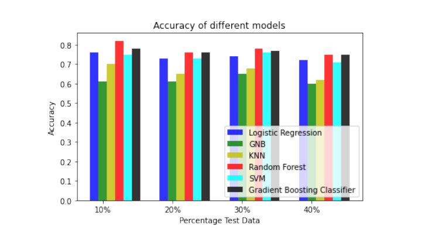

# Hindi-Fake-News-Fact-Checker
In this project, the process of data annotation for fake news in the Hindi language is done. Data
annotation is a very important task and essential for any AI/ML/DL project. Annotated data is used for
training AI/ML/DL models, models learn for this training data and then work on the test data. Although
the task of data annotation when done manually is very tedious and time-consuming it plays a huge role
in determining the accuracy of the model. Data annotation is the key to building a successful AI model
with high accuracy. The higher the accuracy is the better are the results of the model. The accuracy of
the model depends greatly on the quality of the annotated data. If there is even a slight inaccuracy in data
annotation the overall accuracy of the entire model is greatly affected.

A machine-learning and a deep learning based framework to automate the process of data annotation. Our main contributions are:
<li> First collected data from various fact check websites.
<li> After extraction, the next step was pre-processing of data. For pre-processing we removed the punctuations and stopwords from the dataset followed by stemming and lemmatizing. Finally we vectorized
the entire dataset using th TF/IDF Vectorizer.
<li> Finally we applied baseline Machine Learning and Deep Learning Models: Gaussian Naive Bayes,
Linear Regression, K-Nearest Neighbors, Support Vector Machines and Random Forest Search and
Long Short-Term Memory.
<li> The proposed models are tested on 10%, 20%, 30% and 40% test data of the dataset prepared.
Our model has shown very promising results with high accuracy of 82.35% for the Random Forest model
implemented on 10% test data. The highest accuracy for the LSTM model having 100 epochs and a batch
size of 64 implemented on 30% test data was 60.42%. 

### Results of ML and DL Models
 
    

